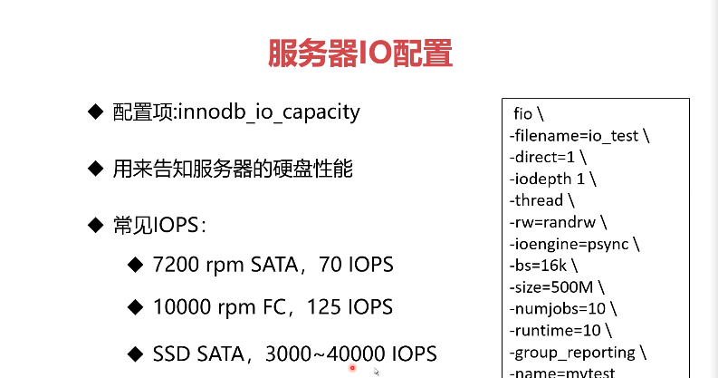
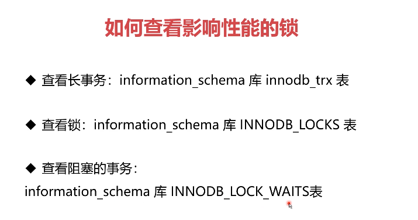
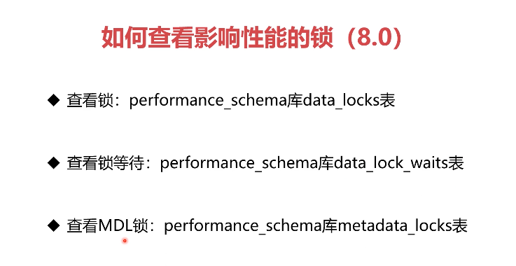
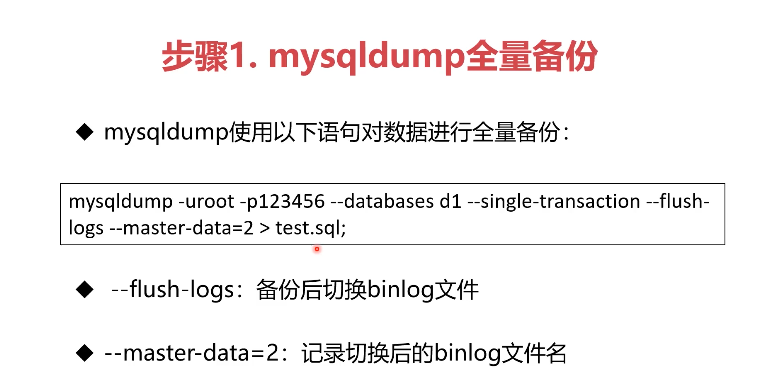
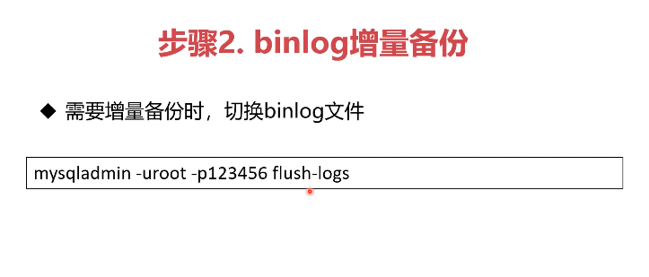
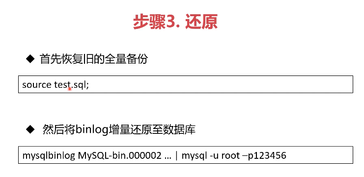

# 基础知识

数据库系统架构 

分层架构， 事件驱动型架构， 管道过滤器架构， 微核架构

Innodb 经历了哪两个时代和哪四种类型 

联合索引的特点 

- 也可加速“最左前缀”的查询
- 可代替最左侧字段的单独索引
- "带头大哥不能死，中间兄弟不能丢"

如何优化前缀索引 

若前缀索引区分度太小可采用：
- 倒序存储
- 新建HASH字段

什么情况下索引会失效 

- like 关键词前面不加 %， 左模糊
- 对字段进行函数操作例如加减乘除
- 字符串和数字比较
- 隐式字符串编码转换

Innodb约束数据方法及建议 

- PrimaryKey / UniqueKey 
- ForeignKey  :  尽量别用，性能消耗大且恢复数据时容易出错
- Default / Not null
- 触发器  ： 少用，业务逻辑用代码实现，方便维护

视图算法有几种 

两种
- MERGE ： 将视图SQL 合并到主查询中
- TEMPTABLE : 将视图作临时表（中间结果）来处理
一般MERGE性能好于TEMPTABLE

无法使用MERGE的SQL
- 聚集函数
- DISTINCT
- GROUP BY
- HAVING
- UNION， UNION ALL 
- 子查询

如何确定使用哪条索引 

- 参考索引基数 Cardinality
- 基数是估算值， 估算方法微选取几个页算出取值的平均值再乘以页数

索引优化方法 

- 强制使用某个索引 force index
- 重新优化索引 analyze index 可重新计算索引基数

count不同字段区别 

- count(字段)<count(主键id<count(索引列)≈count(1)≈count(*)
- 多个索引的情况下选择的原则是索引长度最短、基数偏小
- 如果索引基数一致，选择索引长度最小的
- 在设计数据库的时候字段长度不能随意创建，需要根据需求- 决定，会影响sql性能
- 大表的count()查询优化手段就是新增tinyint类型的标识- 字段，速度可以得到有效提升 

索引优化方法 

- 强制使用某个索引 force index
- 重新优化索引 analyze index 可重新计算索引基数

 order by rand() limit 1性能为什么差 

- 产生了两个临时表， 中间表和sort_buffer表
- rand需要对整个表进行排序，性能差
- 建议使用total查询整个表的行数以后使用 limit n, 1的方式获取随机值

 最左前缀匹配最左边没了怎么办？哪两种方法 

 
 - 索引下推， 减少回表次数 （mysql5.6+）
 - 松散索引扫描，先跟据主索引找到每个值是否有对应的值，速度会加快 （mysql8+）

 分页怎么优化 

 
 - 在索引没有覆盖的情况下先跟据有索引的键找到主id再回表查询

 什么是binlog 

 
 - binlog是server层产生的逻辑日志
 - 用于数据的复制及传输
 - binlog完整记录了数据库的每次操作，可用于数据闪回（回滚）

什么是undolog  

 
 - undolog 又称 回滚日志， 用于 Innodb中，用于事务的回滚和展示旧操作
 - 对于任何数据和缓存的更新都要 先写undolog
 - undolog 位于表空间里的undo segment 中

 什么是redolog 

 
 - redolog是innodb的物理日志，记录数据页的变化
 - innodb日志优于数据，数据写入redolog表示数据已经更新
 - 内存中的数据被更新后写入redolog中，写入磁盘后redolog会被删除
 - redolog默认是4个文件每个1g, 循环写入， 当write pos 追上 check pos时需要等待check pos推进才能继续，只要redolog不丢数据就不会丢

 什么是redolog刷盘？为什么这么做？  

 
 - 因为数据在修改后redolog和undolog还是暂存于内存中的，如果此时突然断电还是会导致数据丢失
 - 通过修改参数 innodb_flush_log_at_trx_commit 参数控制刷盘速度
 0  -- 异步每秒刷盘  1 -- 每一个事务刷盘  N -- 每 N 个事务刷盘  
 - 建议设为 1 

 什么是binlog刷盘 

 
 - 使用 sync_binlog 参数控制 binlog 刷盘
 - 0 自动控制刷盘
 - 1 一个事务刷盘
 - N N 个事务刷盘

 redolog刷盘崩溃会导致什么问题？ 

 
 - redolog 刷盘前崩溃的话会导致 数据丢失
 - redolog 刷盘后崩溃的话重启时系统会对 redolog 进行重放，重写binlog

 为什么 redolog 在 binlog前 

 
 - redolog相当于决断点
 - binlog一旦写入就会传到子数据库，难以撤销，redolog属于中转

 数据库锁有哪几种？ 

 
 - 按照粒度分可分为 全局锁，表级锁， 行级锁
 - 全局锁会锁住左右表，整个库无法修改
 - 表级锁分为表锁（数据锁）和元数据锁
 - 行锁会锁住数据行，分为共享锁和独占锁

 什么是全局锁 

 
 - FTWRL （ flush tables with read lock）
 - 此命令使整个库处于只读状态
 - 主要用途是保证备份的一致性
 - 不要随意使用，杀伤性极大，要在备份数剧库时再用

 什么是表锁（数据锁）和元数据锁 

 
- 命令 lock tables XXX read / write
- 表锁也是非常重的锁，用的也少

- 元数据锁 matadata lock 
- 元数据指的是表的结构，字段，数据类型，索引等
- 事务访问数据时会自动给表加MDL锁
- 事务修改元数据时会自动给表加MDL写锁

 什么是行锁？ 

 
 - 行锁有两种类型，有多种叫法
    + 读锁 / 写锁
    + 共享锁/ 排他锁
    + 共享锁 / 独占锁
    + S 锁 / X 锁
 - S锁不是不让读而是自己要读不让别人写
 - X锁不只是不让写，而是要自己写不让别人读写
 - 只有S和S锁可以兼容

 事务的特性 

 - 原子性 
    - 事务操作要么全部成功要不全部失败
    - 两阶段提交保证了事务的原子性
    - undolog用于撤销操作
 - 一致性
    - 事务必须使数据库从一个一致性状态变化到另一个一致性状态
    - 锁和两阶段提交保证了一致性
- 隔离性
    - 事务不能被其他事务操作数据所干扰
    - 多个并发事务之间要相互隔离
    - 锁和undolog保证了事务的隔离性
- 持久性
    - 一个事务一旦被提交改变将永久保存
    - redolog保证了事务的持久性

 隔离级别 

 
   所有隔离级别都不允许脏写，也就是两个事务同时写同一条数据
 - 读未提交 （ read uncommitted)
    - 读写都不加锁，不隔离
    - 每次查询都查到数据的最新版本
    - 性能最好但是等于没有事务， 很少采用
    - read uncommitted 读不加锁，写加排他锁，并到事务结束之后释放
 - 读提交 (read committed)
    - 一般读取时，读取此时已经提交的数据
    - 写数据时加 X锁， 提交时释放
    - Oracle数剧库默认隔离级别
 - 可重复读 (repeatable-read)
    - 一般读取是，读取本事务开始时的数据状态
    - 写数据时，加X锁，提交时释放
    - Mysql数据库的默认隔离级别
 - 串行化 (serializable)
    - 读加S锁， 写加X锁， 提交时释放
    - 对于一条数据，同时只能有一个事务进行写操作
    - 事务隔离性最高性能太差，很少采用
 

 MVCC如何实现版本控制 

 
- 行记录的版本控制
    - 由于 undolog的存在，可以从最新版本推算之前的版本
- 快照读 （一致性非锁定读）
    - 不锁定数据的情况下，读取数据特定的历史版本
    - 版本有事务的具体需求确定：
        - 读已提交： 跟据每次select时，其他事务的提交情况
        - 可持续读： 跟据事务开始时的id，读取数据特定的历史版本
- 当前读 （一致性锁定读）
   - 读取数据的当前版本，并加锁
   - 若当前版本已被加锁，则阻塞等待

 

 Next-key Lock加锁逻辑 

 
 - 加锁是以Next-Key为基本单位
 - 查找过程在扫描过的范围才加锁
 - 唯一索引等值查询，没有间隙锁，只加行锁
 - 索引等值查询最右一个扫描到的不满足条件值不加行锁
 - 索引覆盖且只加S锁时，不锁主键索引

 - 等值查询间隙锁
 - 非唯一索引等值锁
 - 主键索引范围锁
 - 非唯一索引范围锁
 - 非索引字段查询
   - 锁全表

 为什么要刷脏 

 
- 内存中的脏页太多，内存不足
- redolog 写满，需要推进check point
- 系统空闲，提前刷脏，预防上述情况
- Mysql关闭前，保存数据 
- 前两中会造成性能问题，需要预防

 如何避免被迫刷脏？ 

 
 - 正确告知innodb，服务器的硬盘性能
   - 
 - 合理配置脏页比例上限
 
 - 控制”顺便刷脏“策略
 

 如何解决死锁？ 

 
-  长事务的危害
   - 锁无法释放
      - 行级锁长时间无法释放，导致其他事务等待
         - 当前读会对数据加锁，事务提交前无法释放
         - 其他事务更新相同数据时会等待锁，造成更新性能差
            - 调整 Innodb_lock_wait_timeout参数
      - 容易产生死锁
         - 长事务的锁长时间不释放，容易与其他事务产生死锁
         - 死锁指的是两个事务都依赖对方的锁释放
         - 解决方法
            - 主动死锁检测 innodb_deadlock_detect
            - 发现死锁时回滚代价较小的事务
            - 主动死锁检测默认开启
      - MDL锁hold住大量事务导致MYSQL崩溃
 

 什么是MDL锁？ 

 
 - 事务访问数据时会自动给表加MDL读锁
 - 事务修改元数据时，会自动给表加MDL写锁
 - 遇到锁不兼容时，申请MDL锁的事务会形成一个队列

 - 解决方法
   - alter table前查看是否有长事务还未提交
   - 查看长事务： information_schema库innodb_trx表

 如何查看影响性能的锁 

 

 数据库常用备份 

 
 - mysqldump  
 - xtraBackup

 mysqldump增量备份思路 

 
 - binlog忠实记录了Mysql数据的变化
 - mysqldump全量备份后可以用binlog作为增量
 - mysqldump全量备份是，切换新的binlog
 - 从零还原时，采用全量还原+binlog还原

 如何减少数据库上线问题？

 
 - 最小权限原则，收缩权限
 - 使用自动或手动的手段审计SQL语句
 - 删表前伪删除，再使用自动工具删表
 - 完善上线和运维流程

