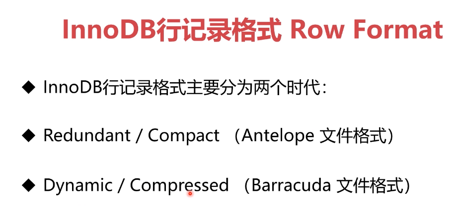

# 基础知识

数据库系统架构 

分层架构， 事件驱动型架构， 管道过滤器架构， 微核架构

Innodb 经历了哪两个时代和哪四种类型 

联合索引的特点 

- 也可加速“最左前缀”的查询
- 可代替最左侧字段的单独索引
- "带头大哥不能死，中间兄弟不能丢"

如何优化前缀索引 

若前缀索引区分度太小可采用：
- 倒序存储
- 新建HASH字段

什么情况下索引会失效 

- like 关键词前面不加 %， 左模糊

Innodb约束数据方法及建议 

- PrimaryKey / UniqueKey 
- ForeignKey  :  尽量别用，性能消耗大且恢复数据时容易出错
- Default / Not null
- 触发器  ： 少用，业务逻辑用代码实现，方便维护

视图算法有几种 

两种
- MERGE ： 将视图SQL 合并到主查询中
- TEMPTABLE : 将视图作临时表（中间结果）来处理
一般MERGE性能好于TEMPTABLE

无法使用MERGE的SQL
- 聚集函数
- DISTINCT
- GROUP BY
- HAVING
- UNION， UNION ALL 
- 子查询

如何确定使用哪条索引 

- 参考索引基数 Cardinality
- 基数是估算值， 估算方法微选取几个页算出取值的平均值再乘以页数

索引优化方法 

- 强制使用某个索引 force index
- 重新优化索引 analyze index 可重新计算索引基数

count不同字段区别 

- count(字段)<count(主键id<count(索引列)≈count(1)≈count(*)
- 多个索引的情况下选择的原则是索引长度最短、基数偏小
- 如果索引基数一致，选择索引长度最小的
- 在设计数据库的时候字段长度不能随意创建，需要根据需求- 决定，会影响sql性能
- 大表的count()查询优化手段就是新增tinyint类型的标识- 字段，速度可以得到有效提升 

索引优化方法 

- 强制使用某个索引 force index
- 重新优化索引 analyze index 可重新计算索引基数

 order by rand() limit 1性能为什么差 

- 产生了两个临时表， 中间表和sort_buffer表
- rand需要对整个表进行排序，性能差
- 建议使用total查询整个表的行数以后使用 limit n, 1的方式获取随机值

